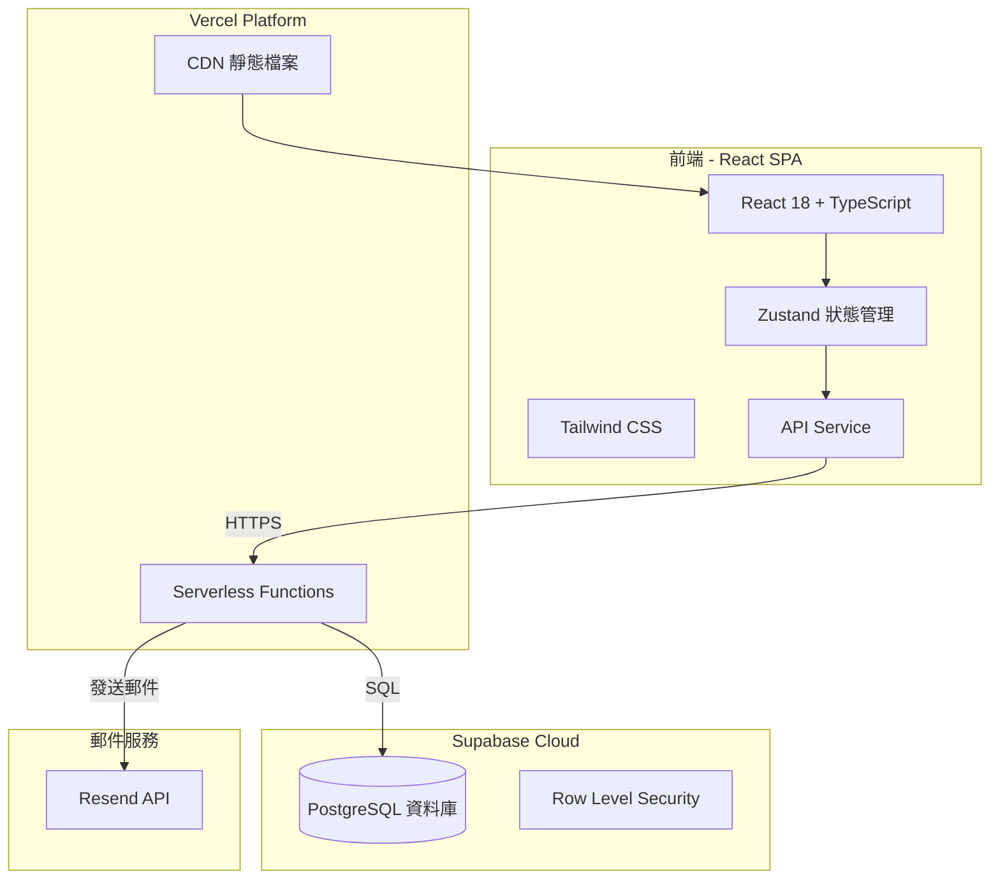

# MATCH POINT - 運動約戰平台

一個專為運動愛好者設計的約戰與組隊平台，讓你輕鬆找到對手或隊友！

## 線上體驗

🌐 **正式網站**: [https://matchup-platform.vercel.app](https://matchup-platform.vercel.app)

---

## 目錄

- [功能特色](#功能特色)
- [系統架構](#系統架構)
- [技術棧](#技術棧)
- [使用指南](#使用指南)
- [本地開發](#本地開發)
- [雲端部署](#雲端部署)
- [資料庫設定](#資料庫設定)
- [API 文件](#api-文件)
- [專案結構](#專案結構)

---

## 功能特色

### 🏀 找隊伍（Team Match）
- 建立隊伍對戰，邀請其他隊伍一對一較量
- 瀏覽所有公開對戰，找到合適的對手
- **加入對戰**：一鍵報名，系統自動交換聯絡資訊

### 👥 找隊員（Player Recruitment）
- 發布招募貼文，尋找志同道合的隊友
- 瀏覽招募資訊，加入心儀的隊伍
- **我要報名**：填寫自我介紹，讓隊長認識你

### 📋 報名管理
- 建立者可查看所有報名者清單
- 顯示報名者聯絡方式（Email、電話）
- 接受或拒絕報名，自動更新隊伍人數

### 🔐 使用者系統
- 安全的註冊/登入功能
- 忘記密碼？透過 Email 重設
- 編輯個人資訊、刪除帳號

### 🔍 篩選與搜尋
- 按運動類別篩選（籃球、足球、羽球...）
- 按地區篩選（北部、中部、南部）
- 按時間篩選（週一到週日）
- 關鍵字全文搜尋

---

## 系統架構



### 架構說明

| 層級 | 技術 | 說明 |
|------|------|------|
| 前端 | React + Vite | 單頁應用程式 (SPA)，提供流暢的使用者體驗 |
| 狀態管理 | Zustand | 輕量級狀態管理，處理使用者登入狀態和資料快取 |
| 樣式 | Tailwind CSS | 原子化 CSS 框架，響應式設計 |
| 後端 | Express.js | RESTful API，部署為 Vercel Serverless Functions |
| 資料庫 | Supabase (PostgreSQL) | 雲端 PostgreSQL 資料庫，內建 RLS 安全機制 |
| 郵件 | Resend | 用於發送密碼重設郵件（可選） |

---

## 技術棧

### 前端
- **React 18** - UI 框架
- **TypeScript** - 型別安全
- **Vite** - 建構工具
- **Tailwind CSS** - 樣式框架
- **Zustand** - 狀態管理
- **React Router** - 路由管理
- **Lucide React** - 圖標庫

### 後端
- **Node.js + Express** - API 伺服器
- **TypeScript** - 型別安全
- **Supabase Client** - 資料庫操作
- **bcryptjs** - 密碼加密
- **Resend** - 郵件發送（可選）

### 部署與基礎設施
- **Vercel** - 前端託管 + Serverless Functions
- **Supabase** - PostgreSQL 資料庫
- **GitHub** - 版本控制

---

## 使用指南

### 1. 註冊與登入

1. 進入網站，點擊 **Sign up** 註冊新帳號
2. 填寫用戶名、Email、密碼（手機號碼選填）
3. 註冊成功後自動登入

### 2. 找隊伍對戰

#### 建立對戰
1. 在首頁選擇「找隊伍」模式
2. 點擊 **+ 建立對戰**
3. 填寫對戰資訊（標題、類別、地點、時間等）
4. 發布後，其他用戶可以看到並報名

#### 加入對戰
1. 瀏覽搜尋結果中的對戰
2. 找到感興趣的對戰，點擊 **加入對戰**
3. 填寫你的隊伍名稱和聯絡方式
4. 報名成功後，系統會顯示建立者的聯絡資訊

### 3. 找隊員招募

#### 發布招募
1. 切換到「找隊員」模式
2. 點擊 **+ 建立招募**
3. 填寫招募資訊和需要的隊員數量

#### 報名加入
1. 瀏覽招募貼文
2. 點擊 **我要報名**
3. 填寫聯絡方式和自我介紹
4. 等待隊長審核

### 4. 管理報名者

1. 在「我建立的」區塊找到你的貼文
2. 點擊 **查看報名者**
3. 查看每位報名者的聯絡資訊和備註
4. 點擊「接受」或「拒絕」處理報名

---

## 本地開發

### 系統需求

- Node.js 18+
- npm 或 yarn
- Supabase 帳號（免費）

### 安裝步驟

1. **Clone 專案**
```bash
git clone https://github.com/your-username/match-point.git
cd match-point
```

2. **安裝前端依賴**
```bash
npm install
```

3. **安裝後端依賴**
```bash
cd backend
npm install
cd ..
```

4. **設定環境變數**

在專案根目錄建立 `.env`：
```env
VITE_API_URL=http://localhost:3000/api
```

在 `backend/` 目錄建立 `.env`：
```env
PORT=3000
SUPABASE_URL=你的Supabase專案URL
SUPABASE_KEY=你的Supabase匿名金鑰
```

5. **設定資料庫**

在 Supabase SQL Editor 執行 [資料庫設定](#資料庫設定) 中的 SQL

6. **啟動開發伺服器**

終端 1 - 後端：
```bash
cd backend
npm run dev
```

終端 2 - 前端：
```bash
npm run dev
```

7. 開啟瀏覽器訪問 `http://localhost:5173`

---

## 雲端部署

### 部署到 Vercel

#### 步驟 1：準備 Supabase

1. 前往 [supabase.com](https://supabase.com) 建立免費帳號
2. 建立新專案，選擇最近的區域
3. 進入 **Project Settings → API**
4. 複製：
   - `Project URL` → 作為 `SUPABASE_URL`
   - `anon public` 金鑰 → 作為 `SUPABASE_KEY`
5. 進入 **SQL Editor**，執行 [資料庫設定](#資料庫設定) 中的 SQL

#### 步驟 2：部署到 Vercel

1. 將專案推送到 GitHub
2. 前往 [vercel.com](https://vercel.com) 並連結 GitHub
3. Import 專案
4. 在 **Environment Variables** 添加：

| 變數名稱 | 值 | 必填 |
|----------|-----|------|
| `SUPABASE_URL` | 你的 Supabase 專案 URL | ✅ |
| `SUPABASE_KEY` | 你的 Supabase anon key | ✅ |
| `RESEND_API_KEY` | Resend API 金鑰 | ❌ |
| `FRONTEND_URL` | `https://你的網域.vercel.app` | ❌ |

5. 點擊 **Deploy**

#### 步驟 3：設定郵件發送（可選）

如需啟用忘記密碼郵件功能：

1. 前往 [resend.com](https://resend.com) 註冊
2. 建立 API Key
3. 在 Vercel 環境變數中添加 `RESEND_API_KEY`
4. 重新部署

> 💡 如未設定 RESEND_API_KEY，系統會以開發模式運行，直接顯示重設連結

---

## 資料庫設定

### 資料表結構

| 資料表 | 說明 |
|--------|------|
| `users` | 使用者帳號資訊 |
| `team_matches` | 隊伍對戰貼文 |
| `player_recruitments` | 隊員招募貼文 |
| `match_registrations` | 對戰報名記錄 |
| `recruitment_applications` | 招募報名記錄 |

### 建立資料表

在 Supabase SQL Editor 中執行以下 SQL：

```sql
-- 使用者資料表
CREATE TABLE IF NOT EXISTS users (
  id UUID PRIMARY KEY DEFAULT gen_random_uuid(),
  username TEXT UNIQUE NOT NULL,
  email TEXT UNIQUE NOT NULL,
  phone TEXT,
  avatar TEXT,
  password TEXT,
  reset_token TEXT,
  reset_token_expires TIMESTAMPTZ,
  created_at TIMESTAMPTZ DEFAULT NOW(),
  updated_at TIMESTAMPTZ DEFAULT NOW()
);

-- 隊伍對戰資料表
CREATE TABLE IF NOT EXISTS team_matches (
  id UUID PRIMARY KEY DEFAULT gen_random_uuid(),
  title TEXT NOT NULL,
  category TEXT NOT NULL,
  region TEXT NOT NULL,
  date TEXT NOT NULL,
  time TEXT NOT NULL,
  location TEXT NOT NULL,
  description TEXT,
  creator_id UUID REFERENCES users(id),
  team_size INTEGER NOT NULL,
  max_teams INTEGER NOT NULL DEFAULT 2,
  current_teams INTEGER NOT NULL DEFAULT 1,
  team_name TEXT,
  created_at TIMESTAMPTZ DEFAULT NOW(),
  updated_at TIMESTAMPTZ DEFAULT NOW()
);

-- 隊員招募資料表
CREATE TABLE IF NOT EXISTS player_recruitments (
  id UUID PRIMARY KEY DEFAULT gen_random_uuid(),
  title TEXT NOT NULL,
  category TEXT NOT NULL,
  region TEXT NOT NULL,
  date TEXT NOT NULL,
  time TEXT NOT NULL,
  location TEXT NOT NULL,
  description TEXT,
  creator_id UUID REFERENCES users(id),
  needed_players INTEGER NOT NULL,
  current_players INTEGER NOT NULL DEFAULT 1,
  team_name TEXT,
  created_at TIMESTAMPTZ DEFAULT NOW(),
  updated_at TIMESTAMPTZ DEFAULT NOW()
);

-- 對戰報名資料表
CREATE TABLE IF NOT EXISTS match_registrations (
  id UUID PRIMARY KEY DEFAULT gen_random_uuid(),
  match_id UUID REFERENCES team_matches(id) ON DELETE CASCADE,
  user_id UUID REFERENCES users(id) ON DELETE CASCADE,
  team_name VARCHAR(100),
  contact_info VARCHAR(255),
  message TEXT,
  status VARCHAR(20) DEFAULT 'pending',
  created_at TIMESTAMPTZ DEFAULT NOW(),
  UNIQUE(match_id, user_id)
);

-- 招募報名資料表
CREATE TABLE IF NOT EXISTS recruitment_applications (
  id UUID PRIMARY KEY DEFAULT gen_random_uuid(),
  recruitment_id UUID REFERENCES player_recruitments(id) ON DELETE CASCADE,
  user_id UUID REFERENCES users(id) ON DELETE CASCADE,
  contact_info VARCHAR(255),
  message TEXT,
  status VARCHAR(20) DEFAULT 'pending',
  created_at TIMESTAMPTZ DEFAULT NOW(),
  UNIQUE(recruitment_id, user_id)
);
```

---

## API 文件

### 認證 API

| 方法 | 端點 | 說明 |
|------|------|------|
| POST | `/api/auth/register` | 註冊新用戶 |
| POST | `/api/auth/login` | 登入 |
| POST | `/api/auth/forgot-password` | 發送密碼重設郵件 |
| POST | `/api/auth/reset-password` | 重設密碼 |
| GET | `/api/auth/verify-reset-token` | 驗證重設 token |

### 隊伍對戰 API

| 方法 | 端點 | 說明 |
|------|------|------|
| GET | `/api/team-matches` | 獲取所有對戰（支援篩選） |
| GET | `/api/team-matches/:id` | 獲取單一對戰 |
| POST | `/api/team-matches` | 建立對戰 |
| PUT | `/api/team-matches/:id` | 更新對戰 |
| DELETE | `/api/team-matches/:id` | 刪除對戰 |
| POST | `/api/team-matches/:id/register` | 報名對戰 |
| GET | `/api/team-matches/:id/registrations` | 獲取報名者清單 |
| PUT | `/api/team-matches/:id/registrations/:regId` | 更新報名狀態 |

### 隊員招募 API

| 方法 | 端點 | 說明 |
|------|------|------|
| GET | `/api/player-recruitments` | 獲取所有招募（支援篩選） |
| GET | `/api/player-recruitments/:id` | 獲取單一招募 |
| POST | `/api/player-recruitments` | 建立招募 |
| PUT | `/api/player-recruitments/:id` | 更新招募 |
| DELETE | `/api/player-recruitments/:id` | 刪除招募 |
| POST | `/api/player-recruitments/:id/apply` | 報名招募 |
| GET | `/api/player-recruitments/:id/applications` | 獲取報名者清單 |
| PUT | `/api/player-recruitments/:id/applications/:appId` | 更新報名狀態 |

---

## 專案結構

```
match-point/
├── api/                        # Vercel Serverless Functions
│   ├── backend/
│   │   ├── routes/             # API 路由
│   │   │   ├── authRoutes.ts   # 認證相關
│   │   │   ├── teamMatchRoutes.ts
│   │   │   ├── playerRecruitmentRoutes.ts
│   │   │   └── userRoutes.ts
│   │   └── supabase.ts         # Supabase 客戶端
│   └── index.ts                # API 入口
├── backend/                    # 本地開發用後端
│   └── src/
│       ├── routes/
│       └── supabase.ts
├── src/                        # 前端原始碼
│   ├── components/             # 可重用組件
│   │   ├── JoinMatchModal.tsx
│   │   ├── ApplyRecruitmentModal.tsx
│   │   ├── RegistrationList.tsx
│   │   └── ...
│   ├── pages/                  # 頁面組件
│   │   ├── Home.tsx
│   │   ├── Login.tsx
│   │   └── ResetPassword.tsx
│   ├── services/               # API 服務
│   │   └── api.ts
│   ├── store/                  # Zustand 狀態管理
│   │   ├── authStore.ts
│   │   ├── teamMatchStore.ts
│   │   └── playerRecruitmentStore.ts
│   └── types/                  # TypeScript 型別
│       └── index.ts
├── vercel.json                 # Vercel 設定
├── package.json
└── README.md
```

---

## 授權

MIT License

---

## 聯絡

如有問題或建議，歡迎提交 Issue 或 Pull Request！
